# Compliance RAG & Red Teaming Suite

## 📖 Overview
This project demonstrates a secure **Compliance RAG (Retrieval Augmented Generation)** system and a corresponding **Red Team Toolkit** to audit it for Indirect Prompt Injection vulnerabilities.

### 🔄 Attack & Defense Pipeline

```mermaid
graph LR
    %% Define Nodes
    subgraph SupplyChain ["📦 Supply Chain Security"]
        H["🔍 Model Audit<br/>(Scanner)"]
    end

    subgraph RedTeam ["🔴 Red Team (Attacker)"]
        A["😈 Attacker AI<br/>(Dolphin-Llama3)"] -->|Generates Prompt Injection| B["📄 Poisoned PDF<br/>(Invisible Payload)"]
    end

    subgraph BlueTeam ["🔵 Blue Team (Defense)"]
        B -->|Ingest w/ OCR| C[("🧠 Vector DB<br/>Pinecone")]
        F("👤 User Query") -->|Retrieve Context| C
        C -->|Risk Analysis| E{"🛡️ LLM Guard<br/>Firewall"}
        E -->|❌ Malicious Payload| G["🚫 BLOCKED<br/>(Security Alert)"]
        E -->|✅ Safe Content| D["🤖 RAG Agent<br/>(Gemini Pro)"]
    end

    %% Relationships
    H -->|Verifies Attacker AI Model Integrity| A

    %% Styles
    style A fill:#ff6b6b,stroke:#333,stroke-width:2px,color:white
    style B fill:#ff6b6b,stroke:#333,stroke-width:2px,color:white
    style C fill:#4ecdc4,stroke:#333,stroke-width:2px,color:white
    style D fill:#4ecdc4,stroke:#333,stroke-width:2px,color:white
    style E fill:#ffe66d,stroke:#333,stroke-width:4px,color:black
    style F fill:#95a5a6,stroke:#333,stroke-width:2px,color:white
    style G fill:#95a5a6,stroke:#333,stroke-width:2px,color:white
    style H fill:#9b59b6,stroke:#333,stroke-width:2px,color:white
```



## 📂 Structure
*   `compliance_rag_app/`: The victim application (LangChain, Pinecone, Google Gemini).
*   `security_audit_tools/`: Offensive tools (Fuzzer, Payload Generator, Supply Chain Scanner).
*   `docs/`: Security audit reports and implementation plans.

## 🛠️ Setup

### 1. Compliance App
```bash
cd compliance_rag_app
pip install -r requirements.txt
cp .env.example .env
# Edit .env with your keys
python app.py
```

### 2. Security Tools
```bash
cd security_audit_tools
# Requires LM Studio running on localhost:1234
python compliance_fuzzer.py
python scan_models.py
```

## 🛡️ Security Architecture (Key Features)

This project implements a **Defense-in-Depth** strategy using industry-standard tools:

### 1. Active Defense: `llm-guard`
We utilize `llm-guard` by ProtectAI to sanitize both Inputs (RAG Retrieval) and Outputs.
*   **Role**: Acts as a firewall for the LLM.
*   **Implementation**: `rag_core.py` -> `secure_context_retrieval()`
*   ** Capabilities**:
    *   **Prompt Injection Detection**: Scans retrieved chunks for "Jailbreak" patterns (e.g., "Ignore previous instructions").
    *   **Ban Substrings**: Blocks specific blacklisted keywords or phrases.
    *   **Anonymization**: Can mask PII (Personally Identifiable Information) before it hits the LLM.

### 2. Supply Chain Security: `modelaudit`
We use `modelaudit` to verify the integrity of the local AI models (GGUF/Pickle files).
*   **Role**: Prevents "Model Serialization Attacks" where malicious code is hidden inside model weights.
*   **Implementation**: `scan_models.py`
*   **Capabilities**:
    *   **Vulnerability Scanning**: Checks for known CVEs in model dependencies.
    *   **Integrity Verification**: Calculates SHA256 hashes to verify the model hasn't been tampered with.
    *   **Malware Detection**: Scans for dangerous pickle operators (e.g., `os.system`).
