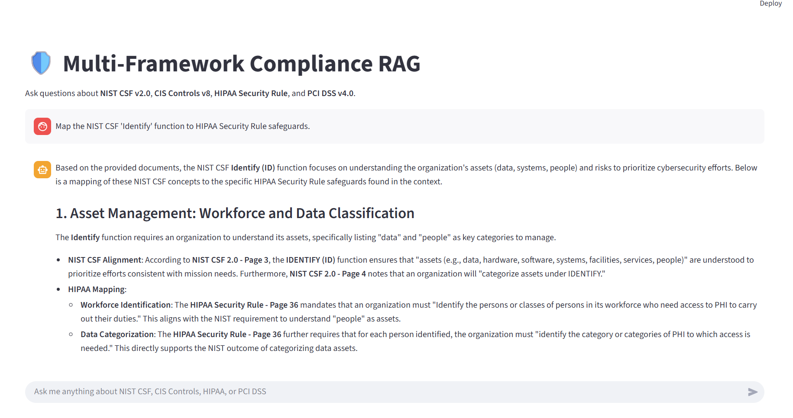
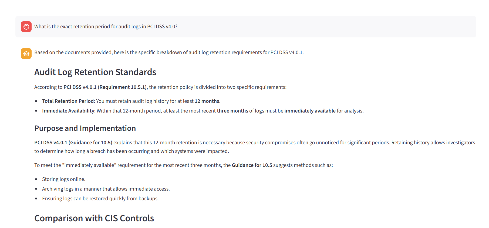
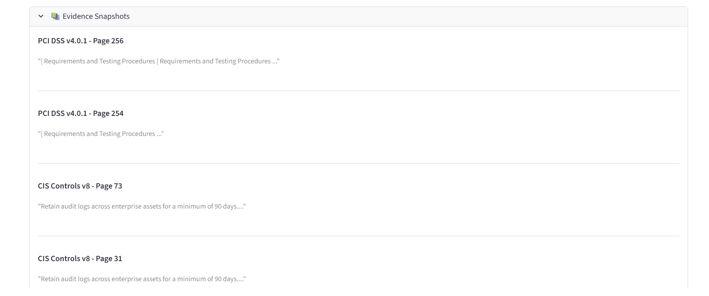

# 🛡️ Multi-Framework Compliance RAG

A powerful **Retrieval-Augmented Generation (RAG)** system designed to assist compliance professionals. It ingests complex regulatory frameworks and allows users to ask questions, perform gap analysis, and cross-map controls using natural language.

## 🚀 Features

*   **Multi-Framework Support**:
    *   ✅ NIST Cybersecurity Framework (CSF) v2.0
    *   ✅ CIS Critical Security Controls v8
    *   ✅ HIPAA Security Rule
    *   ✅ PCI DSS v4.0.1
*   **"X-Ray" Evidence**: Every answer is backed by specific citations and "snapshots" of the original document text.
*   **Dual Interface**:
    *   **Streamlit Web App**: For human users (Chat interface with expandable evidence).
    *   **MCP Server**: For AI agents (Claude Desktop, IDEs) to query the knowledge base programmatically.
*   **Smart Ingestion**: Handles PDF parsing (via Docling), page number correction, and metadata tagging.

## 🛠️ Tech Stack

*   **LLM**: Google Gemini 3.0 Pro Preview (via `langchain-google-genai`)
*   **Vector Database**: Pinecone (Serverless)
*   **Embeddings**: Google Gemini Embeddings (`models/embedding-001`)
*   **Parsing**: Docling (for complex PDF layout & table analysis)
*   **UI**: Streamlit
*   **Agent Protocol**: Model Context Protocol (MCP)

## 📸 Screenshots


*The Multi-Framework Compliance RAG Interface*


*Expandable Evidence Snapshots*


*Cross-Framework Query Example*

## 📦 Setup

1.  **Clone the Repo**
    ```bash
    git clone https://github.com/sazzad2024/multi-framework-compliance-assistant.git
    cd multi-framework-compliance-assistant
    ```

2.  **Install Dependencies**
    ```bash
    python -m venv .venv
    .\.venv\Scripts\activate
    pip install -r requirements.txt
    ```

3.  **Configure Secrets**
    Create a `.env` file in the root directory:
    ```ini
    GOOGLE_API_KEY=your_gemini_key
    PINECONE_API_KEY=your_pinecone_key
    PINECONE_INDEX_NAME=compliance-rag
    ```

4.  **Add Compliance Documents**
    Download the following PDFs and place them in the root folder:
    *   `nist_csf_2.0.pdf`
    *   `CIS_Controls_v8_Guide.pdf`
    *   `hipaa.pdf` (Combined Regulation Text)
    *   `PCI-DSS-v4_0_1.pdf`

5.  **Run Ingestion**
    This parses the PDFs and builds the Pinecone index.
    ```bash
    python ingest.py
    ```

## 🏃‍♂️ Usage

### Option 1: Web Interface (Streamlit)
```bash
streamlit run app.py
```
Open your browser to `http://localhost:8501`.

### Option 2: MCP Server (for Agents)
```bash
mcp dev server.py
```
Connect this server to Claude Desktop or your IDE to give your AI "Compliance Superpowers".

## 🧠 How it Works

1.  **Ingestion**: `ingest.py` uses **Docling** to read PDFs, respecting layout and tables. It chunks the text and fixes page number offsets (e.g., skipping front matter).
2.  **Embedding**: Text chunks are converted to vectors using Gemini Embeddings and stored in Pinecone.
3.  **Retrieval**: When you ask a question, `rag_core.py` finds the top 15 most relevant chunks (Cosine Similarity).
4.  **Generation**: The LLM (Gemini) synthesizes an answer using *only* the retrieved evidence, citing specific documents and pages.

## 📄 License

[MIT License](LICENSE)
